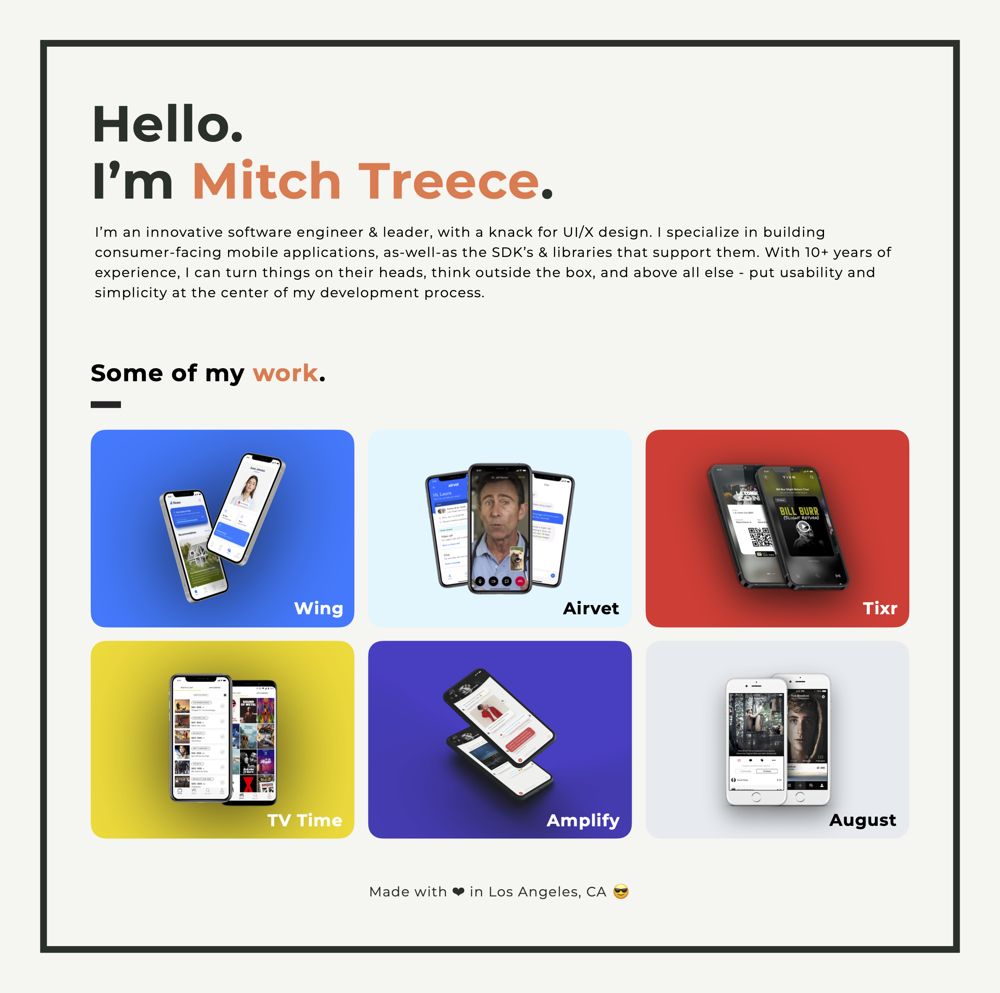

    
     
     
    

        
        
        
        
    

     
    

        &nbsp;
        &nbsp;
        &nbsp;
        &nbsp;
        &nbsp;
        &nbsp;
        &nbsp;
        &nbsp;
    

 

---

 

    

