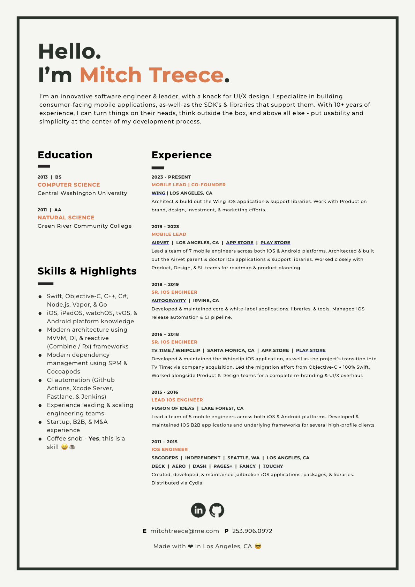

    
     
     
    

        
        
    

     
    

        &nbsp;
        &nbsp;
        &nbsp;
        &nbsp;
        &nbsp;
        &nbsp;
        &nbsp;
        &nbsp;
        &nbsp;
    

--

Hello 👋🏼 
I'm <b>Mitch Treece</b> 😎

 

    

